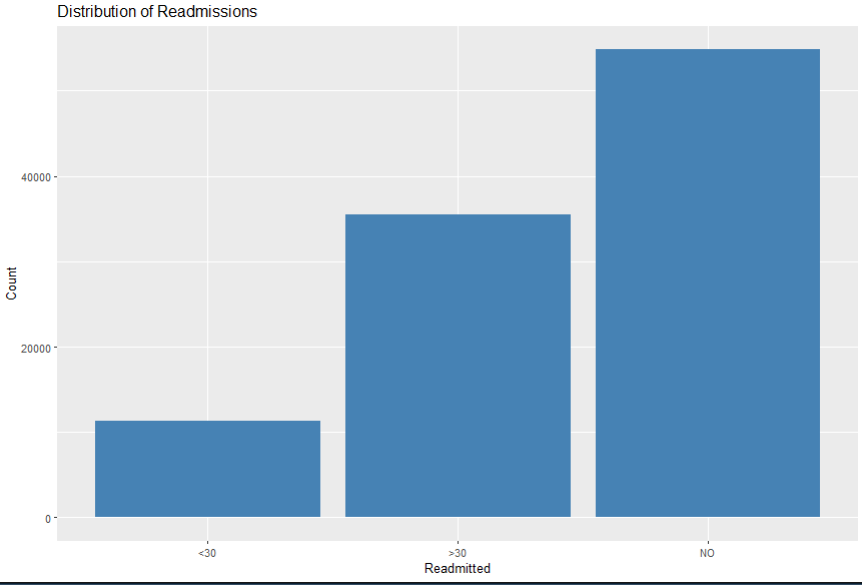

 # Diabetes Readmission Prediction

This project explores the **Diabetes 130-US hospitals dataset** from the UCI Machine Learning Repository.  
The goal is to analyze patient data and predict whether a patient will be readmitted to the hospital within 30 days, after 30 days, or not at all.  

  
The goal is to analyze patient data and predict whether a patient will be readmitted to the hospital within 30 days. 
- They increase **healthcare costs** and put extra strain on limited hospital resources.  
- For patients with **chronic conditions like diabetes**, frequent readmissions can indicate poor disease management, complications, or gaps in continuity of care.  
- Predicting which patients are most at risk of being readmitted helps hospitals:  
  - Design better **preventive interventions**.  
  - Improve **treatment plans**.  
  - Reduce **avoidable healthcare expenses**.  

By applying **data science and machine learning**, this project aims to uncover patterns in patient demographics, diagnoses, and treatments that are linked to hospital readmissions.  

---

---

## 📂 Dataset
- **Source:** [UCI Machine Learning Repository – Diabetes Dataset](https://archive.ics.uci.edu/ml/datasets/diabetes+130-us+hospitals+for+years+1999-2008)  
- **Rows:** ~100,000 hospital admissions  
- **Columns:** 50+ features, including demographics, lab values, medications, diagnoses, and hospital readmission outcome.  

Key variable of interest:
- `readmitted` → `"NO"`, `">30"`, or `"<30"`


## 📊 Sample Visualizations


### Age Distribution of Patients


### Readmitted Distribution



### Readmitted Distribution 2


---
---

## ⚙️ Workflow
1. **Data Loading & Inspection**
   - Load CSV into R (`read.csv` or `readr::read_csv`).
   - Explore dataset structure, missing values, and summary statistics.  

2. **Data Cleaning**
   - Replaced missing values in `medical_specialty` with `"Unknown"`.  
   - Dropped `payer_code` due to high missing values.  
   - Converted `?` placeholders to `NA`.  
   - Will handle categorical encoding for modeling.  

3. **Exploratory Data Analysis (EDA)**
   - Plotted distributions of age groups, readmission outcomes, and other key features using **ggplot2**.  
   - Investigated patterns between demographics and readmission status.  

4. **Feature Engineering (Planned)**
   - Encode categorical variables (e.g., one-hot encoding).  
   - Create binary features for certain medications.  
   - Group diagnosis codes into broader disease categories.  

5. **Modeling (Planned)**
   - Compare classification models (Logistic Regression, Random Forest, XGBoost).  
   - Evaluate with metrics: Accuracy, Precision, Recall, F1-score, AUC.  

---

## 📊 Tools & Libraries
- **R**: `dplyr`, `ggplot2`, `caret`, `tidyr`, `randomForest`, `xgboost`  
- **Version Control**: Git + GitHub  

---

## 🚀 Future Improvements
- Handle class imbalance (likely fewer `<30` readmissions).  
- Hyperparameter tuning with cross-validation.  
- Try deep learning models (TensorFlow/Keras in Python).  

---

## 📌 How to Run
1. Clone the repo:
   ```bash
   git clone https://github.com/yourusername/diabetes-readmission.git
   cd diabetes-readmission
Open R or RStudio.

Install required libraries:

r
Copy code
install.packages(c("dplyr", "ggplot2", "tidyr", "caret", "randomForest", "xgboost"))
Run the analysis script:

r
Copy code
source("analysis.R")
✨ Author
Your Name

Email: edekoethan@gmail.email@example.com

LinkedIn: www.linkedin.com/in/eromosele-edeko-0251211b2

GitHub: https://github.com/edekoethan/Hospital_readmissions-

📖 License
This project is licensed under the MIT License.
